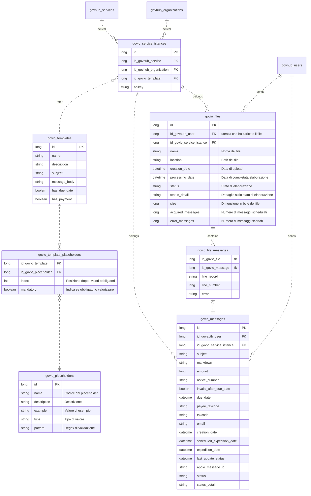

# Database

```mermaid
erDiagram

    govio_templates ||..o{ govio_template_placeholders : ""
    govio_template_placeholders }o..|| govio_placeholders : ""
    govhub_services ||..o{ govio_service_istances : deliver
    govio_service_istances }o..|| govio_templates : refer
    govhub_organizations ||..o{ govio_service_istances : deliver
    govio_service_istances ||..o{ govio_messages : belongs 
    govio_service_istances ||..o{ govio_files : belongs
    govhub_users ||..o{ govio_files : sends  
    govio_files ||..o{ govio_file_messages : contains
    govio_file_messages o|..|| govio_messages : "" 
    govhub_users ||..o{ govio_messages : sends  

    govio_service_istances {
        long id PK
        long id_govhub_service FK
        long id_govhub_organization FK
        long id_govio_template FK
        string apikey
    }

    govio_templates {
        long id PK
        string name
        string description
        string subject
        string message_body
        boolen has_due_date
        boolean has_payment
    }

    govio_template_placeholders {
        long id_govio_template FK
        long id_govio_placeholder FK
        int index "Posizione dopo i valori obbligatori"
        boolean mandatory "Indica se obbligatorio valorizzare"
    }

    govio_placeholders {
        long id PK
        string name "Codice del placeholder"
        string description "Descrizione"
        string example "Valore di esempio"
        string type "Tipo di valore"
        string pattern "Regex di validazione"
    }

    govio_files {
        long id PK
        long id_govauth_user FK "utenza che ha caricato il file" 
        long id_govio_service_istance FK
        string name "Nome del file"
        string location "Path del file"
        datetime creation_date "Data di upload"
        datetime processing_date "Data di completata elaborazione"
        string status "Stato di elaborazione"
        string status_detail "Dettaglio sullo stato di elaborazione"
        long size "Dimensione in byte del file"
        long acquired_messages "Numero di messaggi schedulati"
        long error_messages "Numero di messaggi scartati"
    }

    govio_file_messages {
        long id_govio_file fk
        long id_govio_message fk 
        string line_record
        long line_number
        string error
    }

    govio_messages {
        long id PK
        long id_govauth_user FK
        long id_govio_service_istance FK
        string subject
        string markdown
        long amount
        string notice_number
        boolen invalid_after_due_date
        datetime due_date
        string payee_taxcode
        string taxcode
        string email
        datetime creation_date
        datetime scheduled_expedition_date
        datetime expedition_date
        datetime last_update_status
        string appio_message_id
        string status
        string status_detail
    }

```
