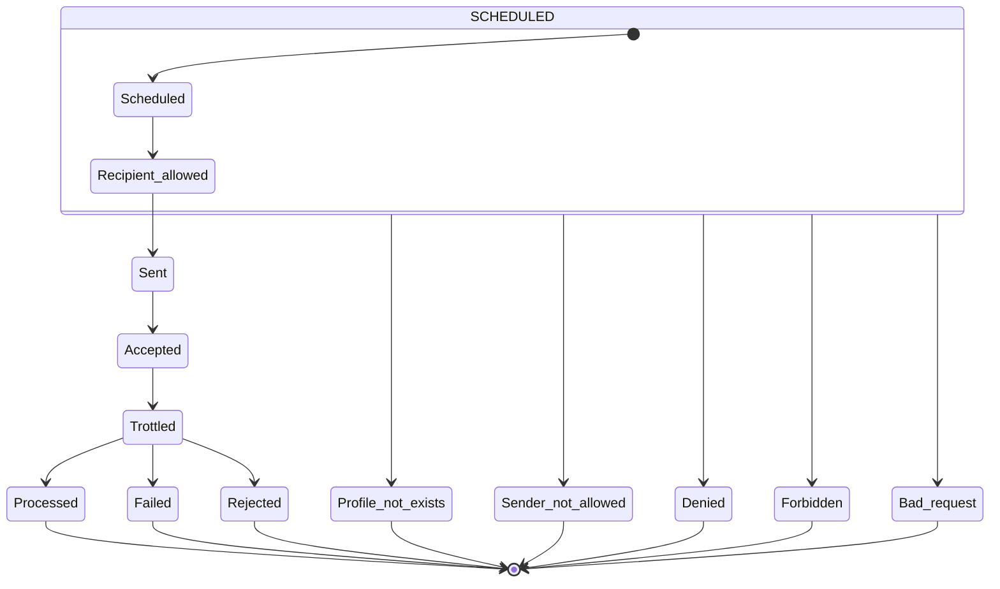

# Consultazione messaggi

\[\[_TOC_]]

Dalla sezione `Messaggi` della console è possibile consultare il dettaglio delle notifiche pianificate dall'AppIO.

## Autorizzazione

Ciascun utente ha possibilità di ricercare e consultare messaggi afferenti ad Organizzazioni o Servizi di cui ha associato un ruolo abilitante a questa operazione.

Per la lista dei ruoli che abilitano alla lettura dei messaggi si rimanda alla sezione Autorizzazioni.

## Dettaglio dei messaggi

La sezione propone la lista dei messaggi che risponde ai criteri di ricerca eventualmente impostati. Selezionando uno dei messaggi si accede al dettaglio che mostra le seguenti informazioni:

* `Oggetto`: l'oggetto della notifica
* `Messaggio`: il corpo del messaggio effettivamente inviato all'utente
* `Utente`: utenza che ha pianificato la spedizione del messaggio
* `Codice fiscale`: identificativo del destinatario
* `Data creazione`: data di inserimento del messaggio
* `Data scadenza`: data di scadenza (`due_date`)
* `Data spedizione pianificata`: data di spedizione programmata
* `Ultimo aggiornamento`: ultima modifica ai dati
* `Stato`: stato di spedizione del messaggio, tra quelli indicati successivamente
* `Id`: identificativo del messaggio in GovIO
* `Organizzazione`: mittente del messaggio
* `Nome servizio`: servizio associato al messaggio
* `Modello`: modello di messaggio
* `AppIO Message Id`: identificativo IO assegnato al messaggio, disponibile solo se inviato

## Stati del messaggio

Di seguito il diaggramma degli stati in cui un messaggio può trovarsi e la descrizione

| Stato                | Etichetta               | Descrizione                                                                                 |
| -------------------- | ----------------------- | ------------------------------------------------------------------------------------------- |
| `Scheduled`          | Schedulato              | Messaggio pronto ad essere spedito alla data fornita                                        |
| `Recipient_allowed`  | Destinatario consentito | Il destinatario dispone dell'AppIO ed ha autorizzato la notifica da parte del servizio      |
| `Sent`               | Inviato                 | Messaggio spedito ad IO                                                                     |
| `Accepted`           | Accettato               | Messaggio preso in carico da IO                                                             |
| `Trottled`           | Limitazione             | L'invio è stato ritardato per congestione del servizio                                      |
| `Processed`          | Elaborato               | Messaggio consegnato al cittadino                                                           |
| `Failed`             |                         |                                                                                             |
| `Rejected`           | Rifiutato               | IO non è riuscito a notificare all'AppIO del cittadino                                      |
| `Profile_not_exists` | Profilo non esiste      | Il cittadino non dispone dell'AppIO                                                         |
| `Sender_not_allowed` | Mittente non consentito | Il destinatario dispone dell'AppIO, ma non ha autorizzato la notifica da parte del servizio |
| `Denied`             | Negato                  | La `Subscription key` configurata nel servizio non è stata accettata                        |
| `Forbidden`          | Proibito                | Non si è autorizzati ad inviare messaggi al destinatario indicato                           |
| `Bad_request`        | Richiesta non valida    | Il messaggio non è conforme alle specifiche del servizio IO                                 |
