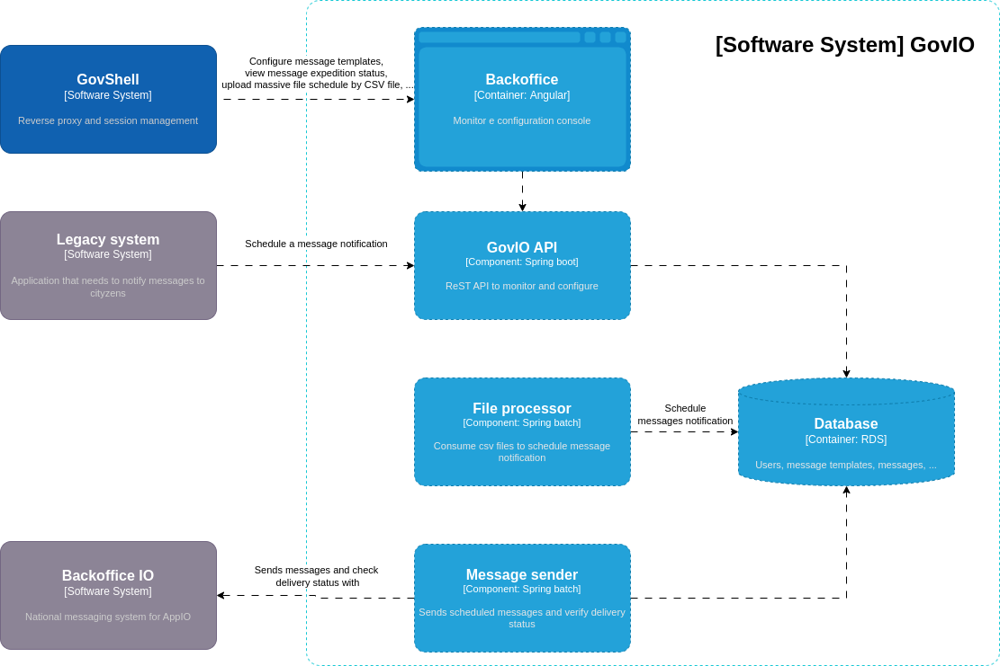

# Architettura

GovNotify è integrato nel framework GovHub e prevede la presenza dei moduli GovShell per l'integrazione della web app di gestione alla dashboard delle applicazioni e di GovRegistry che gestisce le anagrafiche di base.

Per la spedizione delle notifiche al Backoffice IO, servizio nazionale per la notifica all'AppIO, necessita dell'accesso alla rete internet.&#x20;



<figure><figcaption>
GovHub - C4 Diagram Level 1
</figcaption></figure>



<figure><figcaption>
GovIO - C4 Diagram Level 2
</figcaption></figure>


