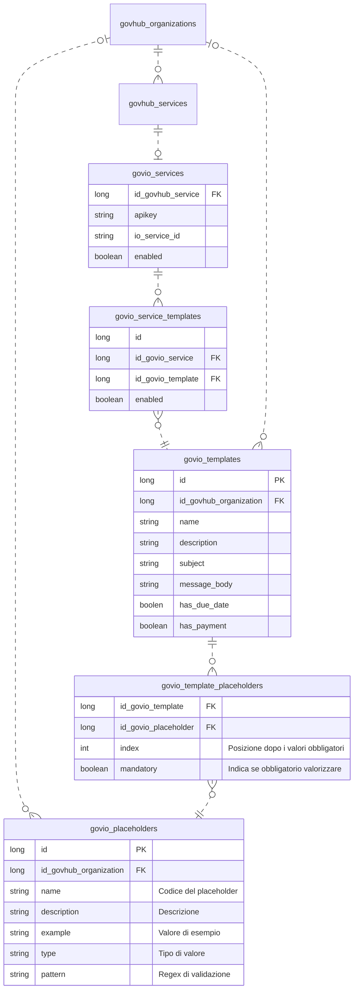

# Configurazione servizi

```mermaid
erDiagram


    govhub_services ||..o| govio_services : ""
    govio_services ||..o{ govio_service_templates : ""
    govio_service_templates }o..|| govio_templates : ""
    govhub_organizations ||..o{ govhub_services : ""
    govhub_organizations o|..o{ govio_templates : ""
    govhub_organizations o|..o{ govio_placeholders : ""
    govio_templates ||..o{ govio_template_placeholders : ""
    govio_template_placeholders }o..|| govio_placeholders : ""

   

    govio_services {
        long id_govhub_service FK
        string apikey
        string io_service_id
        boolean enabled
    }

    govio_service_templates {
        long id
        long id_govio_service FK
        long id_govio_template FK
        boolean enabled
    }

    govio_templates {
        long id PK
        long id_govhub_organization FK
        string name
        string description
        string subject
        string message_body
        boolen has_due_date
        boolean has_payment
    }

    govio_template_placeholders {
        long id_govio_template FK
        long id_govio_placeholder FK
        int index "Posizione dopo i valori obbligatori"
        boolean mandatory "Indica se obbligatorio valorizzare"
    }

    govio_placeholders {
        long id PK
        long id_govhub_organization FK
        string name "Codice del placeholder"
        string description "Descrizione"
        string example "Valore di esempio"
        string type "Tipo di valore"
        string pattern "Regex di validazione"
    }

```
